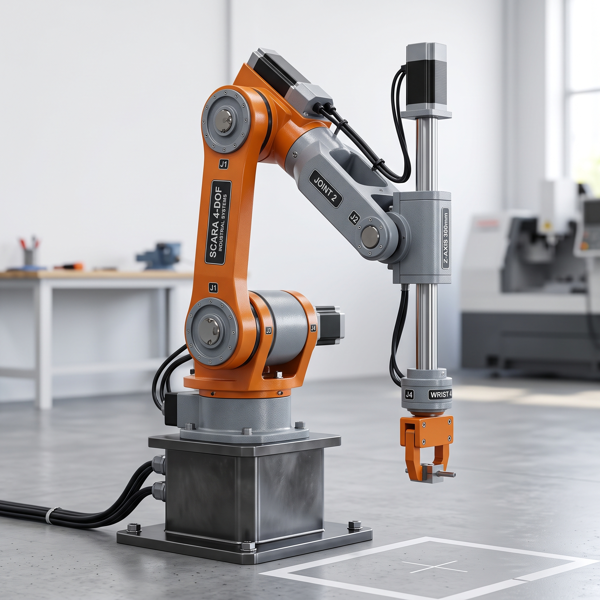
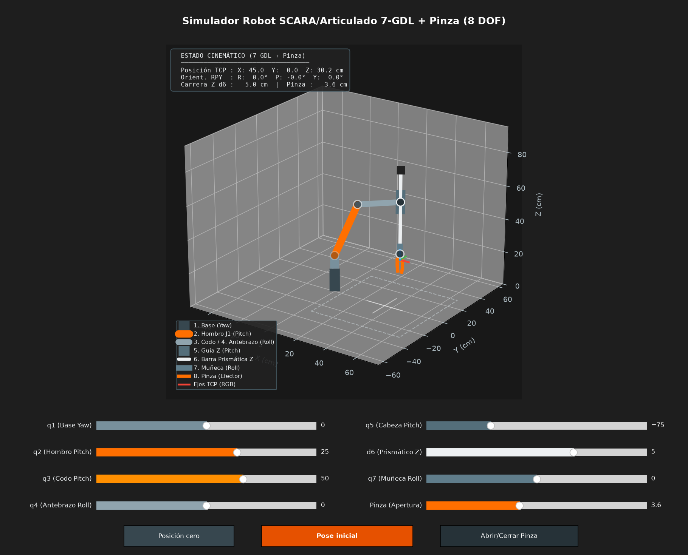

# Simulador Cinemático y Visualizador 3D de Robot Manipulador Híbrido SCARA/Articulado de 7 GDL + Pinza (8 DOF Totales)

Este repositorio contiene la formulación matemática, modelado cinemático directo, implementación computacional y simulación tridimensional interactiva en **Python** (utilizando **NumPy** y **Matplotlib**) de un manipulador robótico industrial híbrido compuesto por una cadena cinemática de **7 Grados de Libertad (GDL)** para posicionamiento y orientación espacial, más **1 Grado de Libertad** para el mecanismo de prensión del efector final (pinza de mordazas paralelas/angulares).

<p align="center">
  
  <br>
  <em>Figura 1: Manipulador industrial híbrido articulado-SCARA de 7 GDL con eje Z prismático y efector final de agarre.</em>
</p>

---

## 📑 Tabla de Contenidos

1. [Introducción y Descripción del Manipulador](#1-introducción-y-descripción-del-manipulador)
2. [Descripción Anatómica y Cinemática de los Eslabones](#2-descripción-anatómica-y-cinemática-de-los-eslabones)
3. [Fundamentación Matemática del Modelo Cinemático](#3-fundamentación-matemática-del-modelo-cinemático)
   - [Matrices de Transformación Homogénea](#matrices-de-transformación-homogénea-se3)
   - [Convención de Denavit-Hartenberg Modificada (Craig)](#convención-de-denavit-hartenberg-modificada-craig)
   - [Tabla de Parámetros Cinemáticos DH](#tabla-de-parámetros-cinemáticos-dh)
   - [Composición Cinemática Global](#composición-cinemática-global)
   - [Extracción de Posición Cartesiana y Orientación (Ángulos RPY)](#extracción-de-posición-cartesiana-y-orientación-ángulos-rpy)
4. [Modelado Geométrico del Efector Final y Pinza](#4-modelado-geométrico-del-efector-final-y-pinza)
5. [Arquitectura del Código y Módulos](#5-arquitectura-del-código-y-módulos)
6. [Instalación y Requisitos](#6-instalación-y-requisitos)
7. [Manual de Usuario y Operación de la Interfaz Gráfica](#7-manual-de-usuario-y-operación-de-la-interfaz-gráfica)
8. [Análisis Cinemático y Desacoplamiento de Ejes](#8-análisis-cinemático-y-desacoplamiento-de-ejes)

---

## 1. Introducción y Descripción del Manipulador

El robot modelado en este proyecto corresponde a una arquitectura robótica industrial avanzada de tipo **híbrido articulado-SCARA**. A diferencia de los robots SCARA tradicionales (cuyos eslabones principales se desplazan únicamente en un plano horizontal $XY$) o de los brazos antropomórficos puros de 6 GDL, esta configuración combina:

1. Una estructura de elevación y alcance basada en articulaciones rotacionales de hombro y codo con inclinación vertical (**Pitch**).
2. Un grado de libertad de rotación axial a lo largo del antebrazo (**Roll**), permitiendo reorientar el plano de flexión distal.
3. Un cabezal articulado con inclinación (**Pitch**) que orienta la guía lineal vertical.
4. Un actuador lineal prismático que proporciona un desplazamiento vertical directo (**Eje Z** con carrera de $300\text{ mm}$), característico de las aplicaciones de ensamblaje e inserción de alta precisión tipo SCARA.
5. Una muñeca terminal rotacional (**Roll**) para la orientación de la herramienta.
6. Un mecanismo de prensión de mordazas simétricas (Pinza/Gripper) para la manipulación de objetos y piezas cilíndricas.

Esta combinación confiere al manipulador **redundancia cinemática (7 GDL espaciales)**, lo cual permite alcanzar una posición y orientación dada en el espacio de trabajo cartesiano con múltiples configuraciones articulares (optimizando la manipulabilidad, evitando singularidades o esquivando obstáculos en la celda de manufactura).

```
                      [Motor Paso a Paso Z]
                               |
                        [Barra Guía Z]  <-- Desplazamiento Prismático (GDL 6)
                               |
    (Cabeza Pitch: GDL 5) === [Guía]
             |
    [Antebrazo Gris J2]  <-- Rotación Roll longitudinal (GDL 4)
             |
     (Codo Pitch: GDL 3)
             |
     [Brazo Naranja J1]
             |
    (Hombro Pitch: GDL 2)
             |
      [Torreta Yaw: GDL 1]
             |
       [Base Pedestal]
```

---

## 2. Descripción Anatómica y Cinemática de los Eslabones

A continuación se desglosan en detalle cada una de las articulaciones y los elementos estructurales que componen el manipulador:

### Eslabón 0: Pedestal Fijo y Soporte de Base
- **Función:** Proporciona la fijación estructural rígida al piso de la celda de trabajo.
- **Geometría:** Bloque prismático de acero maquinado de $14\text{ cm}$ de altura con pernos de anclaje perimetrales y acometida de cableado posterior.

### Articulación 1 ($q_1$): Rotación de la Base (Yaw)
- **Tipo de par cinemático:** Rotacional (Revoluta $R$).
- **Eje de rotación:** Eje vertical $Z_0$ perpendicular al suelo.
- **Función:** Permite orientar todo el plano de trabajo del brazo en un rango azimutal de $360^\circ$ ($-180^\circ$ a $+180^\circ$).
- **Elemento físico:** Torreta giratoria cilíndrica maquinada montada sobre la base.

### Articulación 2 ($q_2$): Inclinación del Hombro / Articulación Inferior (Pitch)
- **Tipo de par cinemático:** Rotacional (Revoluta $R$).
- **Eje de rotación:** Eje horizontal $Y_1$ (perpendicular al eje vertical de la base).
- **Función:** Controla la elevación e inclinación hacia adelante/atrás del brazo primario.
- **Eslabón asociado:** Brazo principal naranja (etiquetado como **J1 / SCARA 4-DOF**), de longitud $L_1 = 38\text{ cm}$.

### Articulación 3 ($q_3$): Inclinación del Codo (Pitch)
- **Tipo de par cinemático:** Rotacional (Revoluta $R$).
- **Eje de rotación:** Eje horizontal $Y_2$ paralelo al eje del hombro.
- **Función:** Permite la flexión y extensión del antebrazo, modificando el alcance radial del robot.
- **Eslabón asociado:** Núcleo de articulación del codo acoplado al cuerpo del antebrazo gris.

### Articulación 4 ($q_4$): Rotación del Cuerpo / Antebrazo (Roll)
- **Tipo de par cinemático:** Rotacional (Revoluta $R$).
- **Eje de rotación:** Eje longitudinal $Z_3$ colineal a la directriz del antebrazo.
- **Función:** Permite girar axialmente todo el conjunto distal (cabezal, eje prismático y pinza), habilitando cambios en el plano de aproximación.
- **Eslabón asociado:** Antebrazo gris maquinado (etiquetado como **JOINT 2 J2**), de longitud $L_2 = 30\text{ cm}$.

### Articulación 5 ($q_5$): Inclinación de la Cabeza previa a la Barra (Pitch)
- **Tipo de par cinemático:** Rotacional (Revoluta $R$).
- **Eje de rotación:** Eje transversal $Y_4$ perpendicular al eje longitudinal del antebrazo.
- **Función clave:** Permite compensar activamente las inclinaciones del hombro y codo para mantener la barra guía vertical en todo momento (a plomo, como un SCARA estándar) o inclinarla intencionalmente para aproximaciones oblicuas.
- **Eslabón asociado:** Cabezal porta-guía ("Z-AXIS 300mm").

### Articulación 6 ($d_6$): Desplazamiento Lineal Vertical (Prismático / Eje Z)
- **Tipo de par cinemático:** Prismático (Deslizante $P$).
- **Eje de movimiento:** Eje axial $Z_5$ de la barra vertical.
- **Función:** Proporciona un movimiento de traslación pura de alta rigidez para operaciones de inserción, prensado y pick-and-place vertical.
- **Elemento físico:** Barra cilíndrica cromada y rectificada de longitud total $L_{\text{rod}} = 42\text{ cm}$ impulsada por un servomotor/motor paso a paso superior, con carrera útil de $\pm 15\text{ cm}$ ($300\text{ mm}$ de recorrido total).

### Articulación 7 ($q_7$): Rotación de la Muñeca (Roll)
- **Tipo de par cinemático:** Rotacional (Revoluta $R$).
- **Eje de rotación:** Eje axial $Z_6$ colineal a la barra cromada.
- **Función:** Orientación angular final de la herramienta de prensión para alinear la pinza con la pieza de trabajo.
- **Elemento físico:** Módulo cilíndrico de brida terminal (etiquetado como **WRIST 4**).

### Articulación 8 ($q_{\text{grip}}$): Mecanismo de Agarre (Pinza / Efector Final)
- **Tipo de par cinemático:** Mecanismo articulado de apertura/cierre de 1 GDL.
- **Función:** Cierre simétrico y apertura regulable de las mordazas para sujetar piezas mecanizadas cilíndricas o prismáticas.
- **Rango de apertura:** $0.4\text{ cm}$ (completamente cerrada sobre la pieza) hasta $8.0\text{ cm}$ (apertura máxima).

---

## 3. Fundamentación Matemática del Modelo Cinemático

### Matrices de Transformación Homogénea (SE(3))

Cada sistema de coordenadas fijo a un eslabón $i$ se relaciona con el sistema anterior $i-1$ mediante una matriz de transformación homogénea $T_{i-1, i} \in \mathbb{R}^{4 \times 4}$, perteneciente al grupo especial euclidiano $SE(3)$:

$$T_{i-1, i} = \begin{bmatrix}
R_{3\times 3} & p_{3\times 1} \\
0_{1\times 3} & 1
\end{bmatrix} = \begin{bmatrix}
r_{11} & r_{12} & r_{13} & p_x \\
r_{21} & r_{22} & r_{23} & p_y \\
r_{31} & r_{32} & r_{33} & p_z \\
0 & 0 & 0 & 1
\end{bmatrix}$$

Donde $R_{3\times 3}$ describe la matriz ortonormal de rotación relativa y $p_{3\times 1}$ representa el vector de traslación entre los orígenes de ambos sistemas.

Las matrices elementales de rotación y traslación utilizadas son:

$$\text{Rot}_X(\theta) = \begin{bmatrix}
1 & 0 & 0 & 0 \\
0 & \cos\theta & -\sin\theta & 0 \\
0 & \sin\theta & \cos\theta & 0 \\
0 & 0 & 0 & 1
\end{bmatrix}, \quad
\text{Rot}_Y(\theta) = \begin{bmatrix}
\cos\theta & 0 & \sin\theta & 0 \\
0 & 1 & 0 & 0 \\
-\sin\theta & 0 & \cos\theta & 0 \\
0 & 0 & 0 & 1
\end{bmatrix}$$

$$\text{Rot}_Z(\theta) = \begin{bmatrix}
\cos\theta & -\sin\theta & 0 & 0 \\
\sin\theta & \cos\theta & 0 & 0 \\
0 & 0 & 1 & 0 \\
0 & 0 & 0 & 1
\end{bmatrix}, \quad
\text{Trans}(x, y, z) = \begin{bmatrix}
1 & 0 & 0 & x \\
0 & 1 & 0 & y \\
0 & 0 & 1 & z \\
0 & 0 & 0 & 1
\end{bmatrix}$$

---

### Convención de Denavit-Hartenberg Modificada (Craig)

En la convención de Craig (Modified Denavit-Hartenberg), la transformación entre el sistema $\{i-1\}$ y $\{i\}$ se realiza mediante la siguiente secuencia de cuatro transformaciones elementales:

$$T_{i-1, i} = \text{Rot}_X(\alpha_{i-1}) \cdot \text{Trans}_X(a_{i-1}) \cdot \text{Rot}_Z(\theta_i) \cdot \text{Trans}_Z(d_i)$$

Dando como resultado la matriz:

$$T_{i-1, i} = \begin{bmatrix}
\cos\theta_i & -\sin\theta_i & 0 & a_{i-1} \\
\sin\theta_i \cos\alpha_{i-1} & \cos\theta_i \cos\alpha_{i-1} & -\sin\alpha_{i-1} & -d_i \sin\alpha_{i-1} \\
\sin\theta_i \sin\alpha_{i-1} & \cos\theta_i \sin\alpha_{i-1} & \cos\alpha_{i-1} & d_i \cos\alpha_{i-1} \\
0 & 0 & 0 & 1
\end{bmatrix}$$

Donde los cuatro parámetros cinemáticos son:
- $\alpha_{i-1}$: Ángulo de torsión de eslabón alrededor de $X_{i-1}$ desde $Z_{i-1}$ hacia $Z_i$.
- $a_{i-1}$: Longitud de eslabón medida a lo largo de $X_{i-1}$ entre $Z_{i-1}$ y $Z_i$.
- $\theta_i$: Ángulo de articulación alrededor de $Z_i$ entre $X_{i-1}$ y $X_i$ (variable para articulaciones rotacionales).
- $d_i$: Desplazamiento de articulación a lo largo de $Z_i$ entre $X_{i-1}$ y $X_i$ (variable para articulaciones prismáticas).

---

### Tabla de Parámetros Cinemáticos DH

Para el manipulador de 7 GDL, considerando las dimensiones reales en centímetros:
- $h_{\text{pedestal}} = 14.0\text{ cm}$, $h_{\text{turret}} = 8.0\text{ cm}$ (Altura total base $d_1 = 22.0\text{ cm}$)
- $L_1 = 38.0\text{ cm}$ (Brazo J1)
- $L_2 = 30.0\text{ cm}$ (Antebrazo J2)
- $L_{\text{guide}} = 14.0\text{ cm}$ (Guía vertical)
- $d_6 \in [-15.0, +15.0]\text{ cm}$ (Carrera prismática útil)
- $L_{\text{wrist}} = 4.5\text{ cm}$, $L_{\text{palm}} = 3.5\text{ cm}$, $L_{\text{finger}} = 7.0\text{ cm}$

| Articulación ($i$) | $\alpha_{i-1}$ | $a_{i-1}$ | $\theta_i$ (variable) | $d_i$ (variable) | Tipo | Descripción |
|:---:|:---:|:---:|:---:|:---:|:---:|:---|
| **1** | $0^\circ$ | $0$ | $q_1$ | $d_1 = 22.0\text{ cm}$ | Revoluta | Base Yaw |
| **2** | $+90^\circ$ | $0$ | $q_2$ | $0$ | Revoluta | Hombro Pitch |
| **3** | $0^\circ$ | $L_1 = 38.0\text{ cm}$ | $q_3$ | $0$ | Revoluta | Codo Pitch |
| **4** | $+90^\circ$ | $0$ | $q_4$ | $0$ | Revoluta | Antebrazo Roll |
| **5** | $-90^\circ$ | $0$ | $q_5$ | $L_2 = 30.0\text{ cm}$ | Revoluta | Cabeza Pitch |
| **6** | $+90^\circ$ | $0$ | $0^\circ$ (fijo) | $d_6$ | Prismática | Carrera Vertical Z |
| **7** | $0^\circ$ | $0$ | $q_7$ | $L_{\text{wrist}} = 8.0\text{ cm}$ | Revoluta | Muñeca Roll |
| **Tool / TCP** | $0^\circ$ | $0$ | $0^\circ$ | $L_{\text{grip}} = 7.0\text{ cm}$ | Fija | Centro de Pinza (TCP) |

---

### Composición Cinemática Global

La posición y orientación final del efector terminal (Tool Center Point - TCP) respecto al sistema de referencia global inercial de la base $\{0\}$ se obtiene mediante el producto acumulativo de las matrices de transformación:

$$T_{0, \text{TCP}} = T_{0, 1}(q_1) \cdot T_{1, 2}(q_2) \cdot T_{2, 3}(q_3) \cdot T_{3, 4}(q_4) \cdot T_{4, 5}(q_5) \cdot T_{5, 6}(d_6) \cdot T_{6, 7}(q_7) \cdot T_{7, \text{TCP}}$$

Donde:
- $T_{0,1}$: Posiciona la base y rota la torreta azimutalmente.
- $T_{1,2}$: Aplica la inclinación del hombro sobre el eje horizontal.
- $T_{2,3}$: Transmite la posición a lo largo del brazo naranja $L_1$ y aplica el ángulo del codo.
- $T_{3,4}$: Aplica la rotación axial (Roll) sobre el eje del antebrazo.
- $T_{4,5}$: Desplaza la distancia del antebrazo $L_2$ e inclina el cabezal de la guía vertical.
- $T_{5,6}$: Aplica el desplazamiento lineal relativo de la barra cromada $d_6$.
- $T_{6,7}$: Aplica la rotación final de la muñeca (WRIST 4).
- $T_{7,\text{TCP}}$: Traslada el origen al centro funcional de agarre entre las mordazas.

---

### Extracción de Posición Cartesiana y Orientación (Ángulos RPY)

Dada la matriz resultante $T_{0, \text{TCP}}$:

$$T_{0, \text{TCP}} = \begin{bmatrix}
r_{11} & r_{12} & r_{13} & p_x \\
r_{21} & r_{22} & r_{23} & p_y \\
r_{31} & r_{32} & r_{33} & p_z \\
0 & 0 & 0 & 1
\end{bmatrix}$$

1. **Posición del efector final:**
   $$p = \begin{bmatrix} p_x \\ p_y \\ p_z \end{bmatrix} = T_{0, \text{TCP}}(1:3, 4)$$

2. **Ángulos de orientación Roll-Pitch-Yaw ($\gamma, \beta, \alpha$):**
   Considerando la convención de rotación $Z(\alpha) Y(\beta) X(\gamma)$:

   $$\beta = \text{atan2}\left(-r_{31}, \sqrt{r_{11}^2 + r_{21}^2}\right)$$
   
   Si $\cos\beta \neq 0$ (condición no singular):
   $$\gamma = \text{atan2}\left(r_{32}, r_{33}\right) \quad (\text{Roll})$$
   $$\alpha = \text{atan2}\left(r_{21}, r_{11}\right) \quad (\text{Yaw})$$

   En caso de singularidad ($\cos\beta \approx 0$, alineación vertical pura / Gimbal Lock):
   $$\gamma = \text{atan2}\left(-r_{23}, r_{22}\right), \quad \alpha = 0$$

---

## 4. Modelado Geométrico del Efector Final y Pinza

El efector final está compuesto por:
1. **Base de la pinza (Palm):** Bloque naranja solidario a la brida de la muñeca.
2. **Mordazas izquierda y derecha (Dedos 1 y 2):** Se desplazan lateralmente de manera simétrica en el eje local $X_{\text{TCP}}$ en función del parámetro de apertura $q_{\text{grip}}$:

$$p_{\text{finger1, base}} = T_{\text{palm}} \cdot \left[-\frac{q_{\text{grip}}}{2}, 0, 0, 1\right]^T$$
$$p_{\text{finger2, base}} = T_{\text{palm}} \cdot \left[\frac{q_{\text{grip}}}{2}, 0, 0, 1\right]^T$$

Cada dedo cuenta con un segmento proximal y una punta de mordaza inclinada para garantizar prensión cilíndrica.
3. **Pieza sujeta (Workpiece):** Cilindro/perno metálico posicionado exactamente en el centro de masa de agarre entre ambas mordazas.
4. **Tríada ortonormal de orientación (Tool Frame):**
   - **Eje X (Rojo):** Dirección lateral transversal de apertura de mordazas.
   - **Eje Y (Verde):** Dirección normal al plano de agarre.
   - **Eje Z (Azul):** Dirección de aproximación/inserción axial de la herramienta.

---

## 5. Arquitectura del Código y Módulos

El archivo principal [`main.py`](file:///home/leandropanesso/master-projects/robot-gdl7/main.py) está estructurado en 5 secciones modulares limpias:

```
main.py
│
├── 1. TRANSFORMACIONES HOMOGÉNEAS
│   ├── dh_matrix(alpha, a, theta, d) -> Matriz DH Craig
│   ├── rot_x(theta), rot_y(theta), rot_z(theta) -> Rotaciones elementales
│   └── trans(x, y, z) -> Traslación homogénea
│
├── 2. CINEMÁTICA DIRECTA Y GEOMETRÍA 3D
│   └── get_robot_skeleton_7gdl(...) -> Calcula los frames y vértices 3D
│
├── 3. CONFIGURACIÓN VISUAL DEL ENTORNO MATPLOTLIB 3D
│   ├── Configuración de figura oscura (Dark Mode #1E1E1E)
│   ├── Inicialización de líneas 3D para cada eslabón y articulación
│   ├── Creación de la tríada RGB de orientación
│   └── Creación del HUD informativo de texto
│
├── 4. BUCLE REACTIVO DE ACTUALIZACIÓN
│   └── update(val) -> Callback que actualiza geometrías y texto en tiempo real
│
└── 5. INTERFAZ DE USUARIO Y CONTROLES INTERACTIVOS
    ├── 8 Sliders en 2 columnas (q1 .. q4, q5 .. q_grip)
    ├── Botón 'Posición Home' (Pose neutral cero)
    ├── Botón 'Pose de la Imagen' (Reproduce la fotografía con precisión)
    └── Botón 'Abrir/Cerrar Pinza' (Toggle rápido de agarre)
```

---

## 6. Instalación y Requisitos

### Requisitos del Sistema
- **Python:** Versión 3.8 o superior.
- **Bibliotecas:** `numpy` ($\ge 1.20$), `matplotlib` ($\ge 3.4$).

### Creación de Entorno Virtual y Ejecución

```bash
# 1. Clonar o ubicarse en el directorio del repositorio
cd /home/leandropanesso/master-projects/robot-gdl7

# 2. (Opcional) Crear y activar un entorno virtual
python3 -m venv venv
source venv/bin/activate

# 3. Instalar dependencias necesarias
pip install numpy matplotlib

# 4. Iniciar la simulación interactiva
python3 main.py
```

---

## 7. Manual de Usuario y Operación de la Interfaz Gráfica

<p align="center">
  
  <br>
  <em>Figura 2: Interfaz gráfica 3D interactiva en Matplotlib con HUD cinemático, leyenda y panel de control.</em>
</p>

Al ejecutar `main.py`, se abrirá una ventana interactiva de Matplotlib con el entorno 3D y los controles en la parte inferior:

```
+-------------------------------------------------------------------------+
| [Simulador Robot SCARA/Articulado 7-GDL + Pinza]                        |
|                                                                         |
|   (Vista 3D Interactiva: Rotar con clic izquierdo, Zoom con clic der.) |
|   [HUD: Posición X, Y, Z | Roll, Pitch, Yaw | Carrera Z | Apertura]     |
|                                                                         |
|-------------------------------------------------------------------------|
| Columna 1 (Base & Brazo)               | Columna 2 (Cabeza & Muñeca)    |
| q1 (Base Yaw):       [---O------] 0°   | q5 (Cabeza Pitch): [--O-------] -75°|
| q2 (Hombro Pitch):   [------O---] 25°  | d6 (Prismático Z): [-----O----] 5cm |
| q3 (Codo Pitch):     [--------O-] 50°  | q7 (Muñeca Roll):  [---O------] 0°  |
| q4 (Antebrazo Roll): [---O------] 0°   | Pinza (Apertura):  [---O------] 3.5cm|
|-------------------------------------------------------------------------|
|  [ Posición Home ]      [ Pose de la Imagen ]      [ Abrir/Cerrar Pinza ]  |
+-------------------------------------------------------------------------+
```

### Funciones de los Botones:
1. **`Posición Home`:** Lleva todos los ángulos a cero ($q = [0, 0, 0, 0, 0, 0, 0]$), colocando el brazo en extensión vertical de referencia.
2. **`Pose de la Imagen`:** Configura de forma instantánea el robot con los ángulos exactos de la fotografía industrial:
   - $q_1 = 0^\circ$ (Base centrada)
   - $q_2 = 25^\circ$ (Hombro inclinado hacia adelante)
   - $q_3 = 50^\circ$ (Codo flexionado)
   - $q_4 = 0^\circ$ (Antebrazo sin torsión axial)
   - $q_5 = -75^\circ$ (Compensación de cabeza: $-(q_2 + q_3)$, garantizando que la barra vertical quede perpendicular al suelo a $90^\circ$)
   - $d_6 = 5.0\text{ cm}$ (Barra descendida hacia la pieza de trabajo)
   - $q_7 = 0^\circ$ (Muñeca neutra)
   - $q_{\text{grip}} = 3.5\text{ cm}$ (Pinza ajustada sujetando el pasador cilíndrico)
3. **`Abrir/Cerrar Pinza`:** Alterna de forma inmediata entre $0.6\text{ cm}$ (agarre firme) y $6.0\text{ cm}$ (liberación de la pieza).

### Navegación 3D:
- **Rotación de cámara:** Clic izquierdo sostenido y arrastrar el cursor.
- **Zoom:** Clic derecho sostenido y arrastrar verticalmente, o rueda del ratón.
- **Panorámica (Pan):** Presionar tecla `Shift` + Clic izquierdo sostenido.

---

## 8. Análisis Cinemático y Desacoplamiento de Ejes

Una de las propiedades más destacadas de este manipulador de 7 GDL es el **desacoplamiento de la orientación de la herramienta**:

### Condición de Barra Vertical Plomada (Modo SCARA Puro)
Para que el eje prismático vertical $Z_5$ se mantenga rigurosamente paralelo al eje de la gravedad ($Z_0$) independientemente del alcance del brazo ($L_1, L_2$), la articulación de cabeza $q_5$ debe satisfacer en tiempo real la relación de compensación:

$$q_5 = -(q_2 + q_3)$$

Cuando esta condición se cumple, la barra se desplaza exclusivamente en dirección vertical en el plano cartesiano $Z$, comportándose funcionalmente como un robot SCARA cilíndrico de alta velocidad, pero con la ventaja de poder plegar el brazo hacia atrás o esquivar obstáculos gracias a las articulaciones $q_2, q_3, q_4$.

### Ventajas de la Redundancia (7 GDL vs 6 GDL)
1. **Evitación de Singularidades:** El manipulador puede evitar la singularidad de codo completamente estirado o doblado mediante reconfiguración del ángulo de roll $q_4$.
2. **Optimización de Espacio de Trabajo:** Permite operaciones en espacios confinados donde una columna vertical rígida no podría ingresar.
3. **Flexibilidad en Tareas de Ensamble:** Permite insertar piezas tanto verticalmente ($q_5 = -(q_2+q_3)$) como con inclinaciones arbitrarias ($q_5 \neq -(q_2+q_3)$) requeridas en celdas de mecanizado CNC o inspección de calidad.
