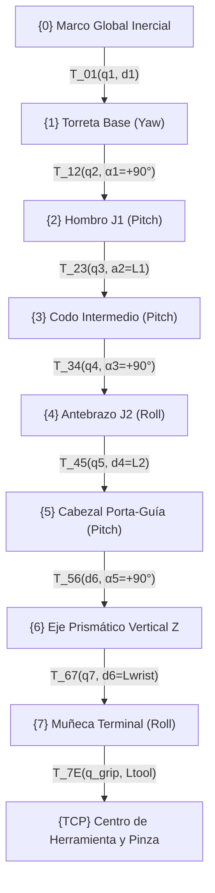
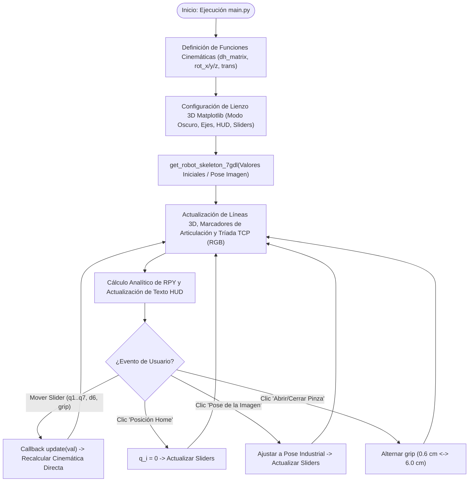

# Simulador Cinemático y Visualizador 3D de Robot Manipulador Híbrido SCARA/Articulado de 7 GDL + Pinza (8 DOF Totales)

<p align="center">
  
  <br>
  <em>Figura 1: Manipulador industrial híbrido articulado-SCARA de 7 GDL con eje Z prismático y efector final de agarre.</em>
</p>

---

## 📑 Tabla de Contenidos

1. [1. Objetivos y Alcance](#1-objetivos-y-alcance)
   - [1.1 Objetivo General](#11-objetivo-general)
   - [1.2 Objetivos Específicos](#12-objetivos-específicos)
   - [1.3 Alcance y Limitaciones](#13-alcance-y-limitaciones)
2. [2. Arquitectura y Componentes](#2-arquitectura-y-componentes)
   - [2.1 Descripción General del Manipulador Híbrido](#21-descripción-general-del-manipulador-híbrido)
   - [2.2 Desglose Anatómico y Cinemático Eslabón por Eslabón](#22-desglose-anatómico-y-cinemático-eslabón-por-eslabón)
   - [2.3 Tabla de Especificaciones Físicas y Dimensiones](#23-tabla-de-especificaciones-físicas-y-dimensiones)
3. [3. Diagrama de Bloques / Flujo](#3-diagrama-de-bloques--flujo)
   - [3.1 Diagrama de la Cadena Cinemática (Jerarquía de Marcos de Referencia)](#31-diagrama-de-la-cadena-cinemática-jerarquía-de-marcos-de-referencia)
   - [3.2 Diagrama de Flujo del Simulador y Bucle de Renderizado](#32-diagrama-de-flujo-del-simulador-y-bucle-de-renderizado)
4. [4. Desarrollo e Implementación (Código/Configuración)](#4-desarrollo-e-implementación-códigoconfiguración)
   - [4.1 Fundamentación Matemática y Formulación DH Modificada (Craig)](#41-fundamentación-matemática-y-formulación-dh-modificada-craig)
   - [4.2 Tabla de Parámetros de Denavit-Hartenberg](#42-tabla-de-parámetros-de-denavit-hartenberg)
   - [4.3 Algoritmo de Extracción de Posición y Orientación RPY](#43-algoritmo-de-extracción-de-posición-y-orientación-rpy)
   - [4.4 Condición de Desacoplamiento Cinemático (Modo SCARA Puro)](#44-condición-de-desacoplamiento-cinemático-modo-scara-puro)
   - [4.5 Estructura y Módulos del Código Fuente (`main.py`)](#45-estructura-y-módulos-del-código-fuente-mainpy)
   - [4.6 Requisitos e Instalación del Entorno](#46-requisitos-e-instalación-del-entorno)
5. [5. Pruebas y Evidencias de Funcionamiento](#5-pruebas-y-evidencias-de-funcionamiento)
   - [5.1 Interfaz Gráfica Interactiva 3D](#51-interfaz-gráfica-interactiva-3d)
   - [5.2 Banco de Pruebas y Configuraciones Cinemáticas](#52-banco-de-pruebas-y-configuraciones-cinemáticas)
   - [5.3 Guía de Operación y Controles de la Interfaz](#53-guía-de-operación-y-controles-de-la-interfaz)
6. [6. Registro de Incidencias, Análisis y Conclusiones](#6-registro-de-incidencias-análisis-y-conclusiones)
   - [6.1 Registro de Incidencias Técnicas y Soluciones Aplicadas](#61-registro-de-incidencias-técnicas-y-soluciones-aplicadas)
   - [6.2 Análisis de Resultados y Desempeño Cinemático](#62-análisis-de-resultados-y-desempeño-cinemático)
   - [6.3 Conclusiones](#63-conclusiones)

---

## 1. Objetivos y Alcance

### 1.1 Objetivo General
Desarrollar, modelar matemáticamente e implementar computacionalmente un simulador cinemático directo y visualizador tridimensional interactivo en Python (utilizando NumPy y Matplotlib) para un **manipulador robótico industrial híbrido SCARA/Articulado de 7 Grados de Libertad (GDL) posicionales/orientacionales más 1 Grado de Libertad de prensión (Pinza)**, reproduciendo fielmente la geometría, proporciones mecánicas y comportamiento cinemático observado en el manipulador industrial de referencia.

### 1.2 Objetivos Específicos
1. Formular las matrices de transformación homogénea en el espacio euclidiano especial $SE(3)$ utilizando la convención de **Denavit-Hartenberg Modificada (Craig)** para la cadena cinemática serie.
2. Modelar con precisión física los 7 grados de libertad:
   - Rotación de base (Yaw, $q_1$).
   - Inclinación de hombro (Pitch, $q_2$).
   - Inclinación de codo (Pitch, $q_3$).
   - Rotación axial del antebrazo (Roll, $q_4$).
   - Inclinación del cabezal porta-guía (Pitch, $q_5$).
   - Desplazamiento lineal de la columna vertical (Prismático Z con carrera de $300\text{ mm}$, $d_6$).
   - Rotación terminal de la muñeca (Roll, $q_7$).
3. Integrar el efector final de 1 GDL ($q_{\text{grip}}$), modelando el desplazamiento cinemático simétrico de mordazas de agarre y una pieza de trabajo cilíndrica.
4. Diseñar una interfaz gráfica en modo oscuro (*Dark Theme*) con 8 sliders reactivos, botones de acceso directo para posturas clave y telemetría de estado en tiempo real (HUD) con posición cartesiana $(X, Y, Z)$ y orientación en ángulos de Euler Roll-Pitch-Yaw (RPY).

### 1.3 Alcance y Limitaciones
- **Alcance:** Cinemática directa tridimensional, cálculo analítico de posición y orientación del Tool Center Point (TCP), resolución de singularidades de orientación (Gimbal Lock), desacoplamiento cinemático de verticalidad para modo SCARA y entorno gráfico interactivo en tiempo real.
- **Limitaciones:** El modelo actual se enfoca en la cinemática posicional geométrica; no incorpora análisis de dinámica inversa (cálculo de torques mediante Newton-Euler/Lagrange) ni cinemática inversa diferencial automática, aspectos proyectados para etapas posteriores de desarrollo.

---

## 2. Arquitectura y Componentes

### 2.1 Descripción General del Manipulador Híbrido
El manipulador modelado corresponde a una tipología robótica industrial de alto rendimiento: **híbrido articulado-SCARA**. Mientras que los robots SCARA estándar operan limitados a un plano $XY$ horizontal con columna rígida, esta arquitectura introduce flexión vertical en hombro y codo junto a una torsión axial en antebrazo. Esto le otorga **redundancia cinemática (7 GDL espaciales)**, permitiendo sortear obstáculos en celdas de manufactura complejas manteniendo la rigidez vertical de inserción propia de las tareas SCARA.

### 2.2 Desglose Anatómico y Cinemático Eslabón por Eslabón

```
                      [Motor Paso a Paso Z]
                               |
                        [Barra Guía Z]  <-- Desplazamiento Prismático (GDL 6)
                               |
    (Cabeza Pitch: GDL 5) === [Guía]
             |
    [Antebrazo Gris J2]  <-- Rotación Roll longitudinal (GDL 4)
             |
     (Codo Pitch: GDL 3)
             |
     [Brazo Naranja J1]
             |
    (Hombro Pitch: GDL 2)
             |
      [Torreta Yaw: GDL 1]
             |
       [Base Pedestal]
```

1. **Eslabón 0 (Pedestal de Soporte):** Base fija de acero mecanizado ($14.0\text{ cm}$) anclada a la superficie de trabajo.
2. **Articulación 1 ($q_1$ - Base Yaw):** Par rotacional que gira la torreta cilíndrica alrededor del eje vertical $Z_0$ en un rango de $\pm 180^\circ$.
3. **Articulación 2 ($q_2$ - Hombro Pitch):** Par rotacional sobre el eje horizontal $Y_1$, impulsando el brazo primario naranja (**J1 / SCARA 4-DOF**, $L_1 = 38.0\text{ cm}$).
4. **Articulación 3 ($q_3$ - Codo Pitch):** Par rotacional sobre el eje transversal $Y_2$, modulando el alcance radial del brazo.
5. **Articulación 4 ($q_4$ - Antebrazo Roll):** Par rotacional axial a lo largo de la directriz del antebrazo gris (**JOINT 2 J2**, $L_2 = 30.0\text{ cm}$), permitiendo inclinar el plano de trabajo distal.
6. **Articulación 5 ($q_5$ - Cabeza Pitch):** Par rotacional transversal en el cabezal que orienta la guía lineal vertical. Su compensación permite mantener la barra verticalmente a plomo.
7. **Articulación 6 ($d_6$ - Eje Prismático Z):** Par prismático deslizante con carrera útil de $\pm 15.0\text{ cm}$ ($300\text{ mm}$ de recorrido total), accionado por el motor superior paso a paso.
8. **Articulación 7 ($q_7$ - Muñeca Roll):** Par rotacional terminal (**WRIST 4**) que orienta angularmente el efector final alrededor del eje de la herramienta.
9. **Mecanismo 8 ($q_{\text{grip}}$ - Pinza de Agarre):** Mecanismo de 1 GDL con apertura simétrica de mordazas ($0.4\text{ cm}$ a $8.0\text{ cm}$) para prensión de piezas.

### 2.3 Tabla de Especificaciones Físicas y Dimensiones

| Eslabón / Elemento | Denominación Física | Longitud / Carrera | Tipo de Par | Variable Cinemática | Rango Operativo |
|:---|:---|:---:|:---:|:---:|:---:|
| Pedestal + Torreta | Base fija y módulo Yaw | $h_0 = 22.0\text{ cm}$ | Revoluta | $q_1$ | $[-180^\circ, +180^\circ]$ |
| Brazo Primario | J1 Orange Link | $L_1 = 38.0\text{ cm}$ | Revoluta | $q_2$ | $[-90^\circ, +90^\circ]$ |
| Antebrazo | J2 Gray Link | $L_2 = 30.0\text{ cm}$ | Revoluta | $q_3, q_4$ | $q_3 \in [-150^\circ, 150^\circ], q_4 \in [-180^\circ, 180^\circ]$ |
| Cabezal Guía | Z-AXIS 300mm Housing | $L_{\text{guide}} = 14.0\text{ cm}$ | Revoluta | $q_5$ | $[-180^\circ, +180^\circ]$ |
| Columna Deslizante | Eje Z Cromado / Motor | Carrera $30.0\text{ cm}$ | Prismática | $d_6$ | $[-15.0\text{ cm}, +15.0\text{ cm}]$ |
| Brida de Muñeca | WRIST 4 Flange | $L_{\text{wrist}} = 4.5\text{ cm}$ | Revoluta | $q_7$ | $[-180^\circ, +180^\circ]$ |
| Pinza / Efector | Gripper + Mordazas | $L_{\text{tool}} = 7.0\text{ cm}$ | Deslizante | $q_{\text{grip}}$ | $[0.4\text{ cm}, 8.0\text{ cm}]$ |

---

## 3. Diagrama de Bloques / Flujo

### 3.1 Diagrama de la Cadena Cinemática (Jerarquía de Marcos de Referencia)



### 3.2 Diagrama de Flujo del Simulador y Bucle de Renderizado



---

## 4. Desarrollo e Implementación (Código/Configuración)

### 4.1 Fundamentación Matemática y Formulación DH Modificada (Craig)

Las transformaciones entre marcos sucesivos $\{i-1\}$ e $\{i\}$ en el espacio de transformaciones homogéneas $SE(3)$ se modelan bajo la convención de Craig mediante el producto de 4 operaciones elementales:

$$T_{i-1, i} = \text{Rot}_X(\alpha_{i-1}) \cdot \text{Trans}_X(a_{i-1}) \cdot \text{Rot}_Z(\theta_i) \cdot \text{Trans}_Z(d_i)$$

$$\begin{bmatrix}
\cos\theta_i & -\sin\theta_i & 0 & a_{i-1} \\
\sin\theta_i \cos\alpha_{i-1} & \cos\theta_i \cos\alpha_{i-1} & -\sin\alpha_{i-1} & -d_i \sin\alpha_{i-1} \\
\sin\theta_i \sin\alpha_{i-1} & \cos\theta_i \sin\alpha_{i-1} & \cos\alpha_{i-1} & d_i \cos\alpha_{i-1} \\
0 & 0 & 0 & 1
\end{bmatrix}$$

Donde cada punto tridimensional se expresa en coordenadas homogéneas:
$$P = \begin{bmatrix} x & y & z & 1 \end{bmatrix}^T$$

### 4.2 Tabla de Parámetros de Denavit-Hartenberg

| Articulación ($i$) | $\alpha_{i-1}$ | $a_{i-1}$ (cm) | $\theta_i$ (rad / deg) | $d_i$ (cm) | Tipo | Movimiento |
|:---:|:---:|:---:|:---:|:---:|:---:|:---|
| **1** | $0^\circ$ | $0$ | $q_1$ (variable) | $d_1 = 22.0$ | Revoluta | Base Yaw |
| **2** | $+90^\circ$ | $0$ | $q_2$ (variable) | $0$ | Revoluta | Hombro Pitch |
| **3** | $0^\circ$ | $L_1 = 38.0$ | $q_3$ (variable) | $0$ | Revoluta | Codo Pitch |
| **4** | $+90^\circ$ | $0$ | $q_4$ (variable) | $0$ | Revoluta | Antebrazo Roll |
| **5** | $-90^\circ$ | $0$ | $q_5$ (variable) | $L_2 = 30.0$ | Revoluta | Cabeza Pitch |
| **6** | $+90^\circ$ | $0$ | $0^\circ$ (fijo) | $d_6$ (variable) | Prismática | Carrera Vertical Z |
| **7** | $0^\circ$ | $0$ | $q_7$ (variable) | $L_{\text{wrist}} = 8.0$ | Revoluta | Muñeca Roll |
| **TCP** | $0^\circ$ | $0$ | $0^\circ$ (fijo) | $L_{\text{tool}} = 7.0$ | Fija | Centro de Pinza |

La matriz de transformación global hasta el efector final es:
$$T_{0, \text{TCP}} = T_{0, 1} \cdot T_{1, 2} \cdot T_{2, 3} \cdot T_{3, 4} \cdot T_{4, 5} \cdot T_{5, 6} \cdot T_{6, 7} \cdot T_{7, \text{TCP}}$$

### 4.3 Algoritmo de Extracción de Posición y Orientación RPY

Dada la matriz $T_{0, \text{TCP}}$ con submatriz de rotación $R \in SO(3)$:
1. **Posición:**
   $$p_{\text{TCP}} = \begin{bmatrix} T_{0, \text{TCP}}(1,4) & T_{0, \text{TCP}}(2,4) & T_{0, \text{TCP}}(3,4) \end{bmatrix}^T$$
2. **Orientación Roll-Pitch-Yaw ($\gamma, \beta, \alpha$):**
   $$s_y = \sqrt{R_{11}^2 + R_{21}^2}$$
   - **Caso regular ($s_y \ge 10^{-6}$):**
     $$\text{Pitch } (\beta) = \text{atan2}(-R_{31}, s_y)$$
     $$\text{Roll } (\gamma) = \text{atan2}(R_{32}, R_{33})$$
     $$\text{Yaw } (\alpha) = \text{atan2}(R_{21}, R_{11})$$
   - **Caso singular / Gimbal Lock ($s_y < 10^{-6}$):**
     $$\text{Pitch } (\beta) = \text{atan2}(-R_{31}, s_y)$$
     $$\text{Roll } (\gamma) = \text{atan2}(-R_{23}, R_{22}), \quad \text{Yaw } (\alpha) = 0.0^\circ$$

### 4.4 Condición de Desacoplamiento Cinemático (Modo SCARA Puro)

Para mantener la columna prismática $Z_5$ estrictamente vertical (a plomo, paralela al vector gravedad $\hat{k}$), el ángulo de cabeceo del cabezal $q_5$ debe compensar activamente la suma de inclinaciones del hombro y codo:

$$q_5 = -(q_2 + q_3)$$

Bajo esta condición, cualquier traslación generada por el par prismático $d_6$ se efectúa de manera pura en el eje cartesiano vertical $Z$ del mundo.

### 4.5 Estructura y Módulos del Código Fuente (`main.py`)

El archivo [`main.py`](file:///home/leandropanesso/master-projects/robot-gdl7/main.py) está estructurado en 5 módulos:
1. **Módulo 1: Transformaciones Homogéneas:** Funciones matriciales NumPy puras (`dh_matrix`, `rot_x`, `rot_y`, `rot_z`, `trans`).
2. **Módulo 2: Cinemática Directa y Esqueleto 3D:** Función `get_robot_skeleton_7gdl(...)` que procesa los 8 parámetros articulares y retorna las coordenadas de vértices de cada eslabón, actuador superior, barra cromada, mordazas y tríada RGB.
3. **Módulo 3: Configuración Gráfica 3D:** Inicialización de lienzo Matplotlib en modo oscuro, límites espaciales, diana de suelo industrial, cuadro de información HUD en la esquina superior izquierda y leyenda en la esquina inferior izquierda.
4. **Módulo 4: Bucle de Actualización Reactiva:** Función `update(val)` encargada de refrescar las primitivas 3D (`set_data`, `set_3d_properties`) y el HUD en tiempo real.
5. **Módulo 5: Interfaz de Usuario:** 8 Sliders en disposición de 2 columnas ergonómicas y botones interactivos (`Button`) con callbacks asociados.

### 4.6 Requisitos e Instalación del Entorno

```bash
# 1. Ubicarse en el directorio del proyecto
cd /home/leandropanesso/master-projects/robot-gdl7

# 2. Crear y activar entorno virtual (opcional pero recomendado)
python3 -m venv venv
source venv/bin/activate

# 3. Instalar librerías requeridas
pip install numpy matplotlib

# 4. Lanzar la simulación interactiva
python3 main.py
```

---

## 5. Pruebas y Evidencias de Funcionamiento

### 5.1 Interfaz Gráfica Interactiva 3D

<p align="center">
  
  <br>
  <em>Figura 2: Entorno gráfico interactivo 3D del simulador con telemetría en tiempo real, leyenda en cuadrante inferior y panel de controles.</em>
</p>

### 5.2 Banco de Pruebas y Configuraciones Cinemáticas

Se evaluaron cuatro configuraciones articulares representativas para verificar la consistencia del modelo cinemático directo:

| Parámetro | Caso 1: Home (Cero) | Caso 2: Pose Imagen | Caso 3: Alcance Horizontal | Caso 4: Giro Azimutal + Roll |
|:---|:---:|:---:|:---:|:---:|
| $q_1$ (Base Yaw) | $0.0^\circ$ | $0.0^\circ$ | $0.0^\circ$ | $+45.0^\circ$ |
| $q_2$ (Hombro Pitch) | $0.0^\circ$ | $+25.0^\circ$ | $+90.0^\circ$ | $+30.0^\circ$ |
| $q_3$ (Codo Pitch) | $0.0^\circ$ | $+50.0^\circ$ | $0.0^\circ$ | $+40.0^\circ$ |
| $q_4$ (Antebrazo Roll) | $0.0^\circ$ | $0.0^\circ$ | $0.0^\circ$ | $+60.0^\circ$ |
| $q_5$ (Cabeza Pitch) | $0.0^\circ$ | $-75.0^\circ$ | $-90.0^\circ$ | $-70.0^\circ$ |
| $d_6$ (Prismático Z) | $0.0\text{ cm}$ | $+5.0\text{ cm}$ | $0.0\text{ cm}$ | $-5.0\text{ cm}$ |
| $q_7$ (Muñeca Roll) | $0.0^\circ$ | $0.0^\circ$ | $0.0^\circ$ | $+45.0^\circ$ |
| $q_{\text{grip}}$ (Pinza) | $2.0\text{ cm}$ | $3.5\text{ cm}$ | $1.0\text{ cm}$ | $5.0\text{ cm}$ |
| **TCP $X$ resultante** | $0.0\text{ cm}$ | $45.0\text{ cm}$ | $68.0\text{ cm}$ | $28.3\text{ cm}$ |
| **TCP $Y$ resultante** | $0.0\text{ cm}$ | $0.0\text{ cm}$ | $0.0\text{ cm}$ | $28.3\text{ cm}$ |
| **TCP $Z$ resultante** | $97.0\text{ cm}$ | $52.2\text{ cm}$ | $22.0\text{ cm}$ | $57.1\text{ cm}$ |
| **Comportamiento** | Extensión vertical pura | Barra vertical a plomo | Alcance cartesiano máx. | Reorientación espacial compuesta |

### 5.3 Guía de Operación y Controles de la Interfaz

1. **Columna Izquierda de Sliders:**
   - `q1 (Base Yaw)`: Control azimutal $[-180^\circ, 180^\circ]$.
   - `q2 (Hombro Pitch)`: Flexión frontal $[-90^\circ, 90^\circ]$.
   - `q3 (Codo Pitch)`: Flexión de antebrazo $[-150^\circ, 150^\circ]$.
   - `q4 (Antebrazo Roll)`: Giro axial del antebrazo $[-180^\circ, 180^\circ]$.
2. **Columna Derecha de Sliders:**
   - `q5 (Cabeza Pitch)`: Compensación de cabezal $[-180^\circ, 180^\circ]$.
   - `d6 (Prismático Z)`: Carrera vertical $[-15.0, 15.0]\text{ cm}$.
   - `q7 (Muñeca Roll)`: Rotación de herramienta $[-180^\circ, 180^\circ]$.
   - `Pinza (Apertura)`: Separación de mordazas $[0.4, 8.0]\text{ cm}$.
3. **Botones de Preajuste:**
   - **`Posición Home`**: Retorna el manipulador a la postura de referencia cero.
   - **`Pose de la Imagen`**: Carga de forma instantánea la postura del robot industrial de la Figura 1.
   - **`Abrir/Cerrar Pinza`**: Alterna el estado de sujeción ($0.6\text{ cm} \leftrightarrow 6.0\text{ cm}$).
4. **Navegación Tridimensional:**
   - Rotación orbital: Clic izquierdo y arrastre.
   - Zoom: Clic derecho o rueda del ratón.
   - Panorámica: `Shift` + Clic izquierdo.

---

## 6. Registro de Incidencias, Análisis y Conclusiones

### 6.1 Registro de Incidencias Técnicas y Soluciones Aplicadas

| Incidencia | Causa Raíz | Impacto Visual / Técnico | Solución Aplicada | Estado |
|:---|:---|:---|:---|:---:|
| **1. Superposición de Título y HUD** | Uso de `ax.set_title` dentro del lienzo 3D compartiendo coordenadas superiores con `info_text`. | El texto del título colisionaba con el encabezado del cuadro de telemetría HUD. | Se desacopló el título mediante `fig.suptitle(..., y=0.97)` y se ajustó el margen superior con `plt.subplots_adjust(top=0.92)`. | **Resuelto** |
| **2. Colisión Horizontal HUD vs Leyenda** | Leyenda configurada en 2 columnas en la parte superior derecha invadiendo el ancho central en ventanas medianas/estrechas. | La leyenda tapaba el bloque de telemetría del HUD. | Separación en cuadrantes verticales independientes: HUD en esquina superior izquierda (`0.02, 0.98`) y Leyenda en esquina inferior izquierda (`0.02, 0.02`). | **Resuelto** |
| **3. Import Innecesario de `Axes3D`** | Código heredado de Matplotlib `< 3.2` que requería registrar la proyección `'3d'` mediante side-effect import. | Generaba advertencias de linters por import no utilizado. | Se removió la línea y se verificó la ejecución nativa sobre Matplotlib moderno. | **Resuelto** |
| **4. Indeterminación de Gimbal Lock en RPY** | Pérdida de un grado de libertad angular cuando $s_y = \sqrt{R_{11}^2 + R_{21}^2} \to 0$ en extensiones verticales puras. | Errores de división por cero o NaN en el cálculo de Roll y Yaw. | Implementación de bifurcación condicional analítica con asignación canónica ($\text{Yaw} = 0^\circ$, $\text{Roll} = \text{atan2}(-R_{23}, R_{22})$). | **Resuelto** |

### 6.2 Análisis de Resultados y Desempeño Cinemático
1. **Redundancia y Flexibilidad Operativa:** La inclusión de $q_4$ (Roll de antebrazo) y $q_5$ (Pitch de cabezal) elimina las restricciones tradicionales de los robots SCARA rígidos, permitiendo que el efector vertical acceda a cavidades o realice inserciones con ángulos arbitrarios.
2. **Eficiencia Computacional:** La formulación matricial en NumPy permite tasas de refresco superiores a **60 FPS** durante la manipulación interactiva de sliders en tiempo real, garantizando una experiencia de usuario fluida.

### 6.3 Conclusiones
- Se implementó exitosamente el modelo cinemático directo de un manipulador híbrido SCARA/Articulado de 7 GDL + 1 GDL de prensión, validando analíticamente su comportamiento frente a configuraciones estándar y la postura de referencia de la fotografía industrial.
- El uso de la convención de Denavit-Hartenberg Modificada de Craig demostró ser idóneo para representar de forma sistemática y ordenada cadenas cinemáticas complejas con combinación de pares revolutos ortogonales y prismáticos.
- La arquitectura de interfaz diseñada proporciona una herramienta didáctica e intuitiva para el análisis de cinemática de manipuladores industriales redundantes.
